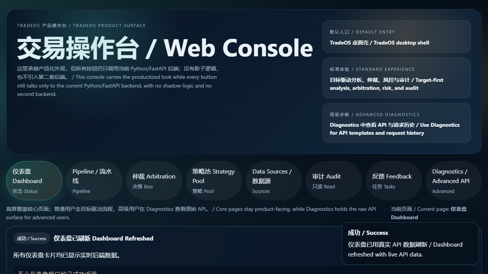

# TradeOS

TradeOS is a local AI trading operating console that connects real-data analysis, formal arbitration, risk planning, simulation execution, audit, feedback, and a desktop-first product shell into one coherent workflow.



## Overview

TradeOS is not positioned as a toy demo or a static frontend shell.  
It is a productized local application built on top of a Phase 1-10 Python/FastAPI backend, with a desktop shell as the default entry and a FastAPI-mounted console as the main user surface.

At a high level, TradeOS currently covers:

- real-data live analysis
- six-module signal generation
- formal arbitration and conflict resolution
- risk sizing and filtering
- simulation execution
- append-only audit and feedback
- strategy-pool re-entry
- desktop shell, console, API, and CLI

## Product Highlights

- Desktop-first local product entry
- FastAPI-mounted bilingual console at `/console/`
- Data Sources, Pipeline, Arbitration, Strategy Pool, Audit, Feedback, and Diagnostics
- Real Yahoo/FRED-backed product flow with explicit proxy boundaries
- Simulation execution, append-only audit, and feedback loop
- Full local pytest suite green with optional research skips

## Product Contract

- Default entry: TradeOS desktop shell
- Default local console: `/console/`, opened inside the desktop shell
- Legacy fallback: `TradeOS/apps/console/`
- Advanced raw API access: Diagnostics / Advanced API
- Users should not need to understand localhost, API, frontend/backend, bridges, or workers

## Entry Matrix

| Entry Type | Command / Path | Notes |
|---|---|---|
| Product entry | `python run.py start` or `.\start.ps1` | Desktop shell with embedded `/console/` |
| Developer API | `python run.py api` | FastAPI only |
| Developer console | `python run.py console` | Browser fallback for `/console/` |
| Legacy fallback | `TradeOS/apps/console/` | Old Streamlit implementation |
| Advanced diagnostics | `/console/?view=diagnostics` | Raw API templates and troubleshooting |
| Optional research extras | `pip install -e ".[research]"` | Research-only dependencies and tests |

## Core Loop

```text
Data Sources
-> Six Modules
-> Arbitration
-> Risk
-> Execution Simulation
-> Audit
-> Feedback
-> Strategy Pool
-> Re-enter Arbitration
```

This is the current product-facing loop. The default data profile exposes real Yahoo market/fundamental/news data, FRED macro data, explicit OrderFlow/Sentiment proxy boundaries, and local simulation execution.

## What Is In The Repository

The active runnable project is in `TradeOS/`.

```text
.
├─ README.md
└─ TradeOS/
   ├─ apps/
   ├─ core/
   ├─ docs/
   ├─ infra/
   ├─ tests/
   ├─ run.py
   ├─ start.ps1
   └─ requirements-local.txt
```

Key areas inside `TradeOS/`:

- `apps/`
  - desktop shell, API, web console, CLI, DTO layer
- `core/data/`
  - providers, adapters, validation, live orchestration, source registry
- `core/research/`
  - alpha system, datasets, backtest, optimizer-related research workflows
- `core/analysis/`
  - Fundamental, Macro, Technical, Chan, OrderFlow, Sentiment
- `core/arbitration/`
  - signal collection, rules chain, decision generation
- `core/risk/`
  - sizing, filters, execution planning
- `core/audit/`
  - decision/risk/execution audit, feedback engine, append-only registries
- `core/strategy_pool/`
  - strategy composition, weight allocation, arbitration bridge

## Quick Start

### Default Product Start

```powershell
cd TradeOS
.\start.ps1
```

or:

```powershell
cd TradeOS
python run.py start
```

This launches the TradeOS desktop shell, starts the embedded FastAPI backend, opens the console inside an app window, and shuts the backend down when the window closes.

### Developer Commands

```powershell
cd TradeOS
python run.py desktop-smoke
python run.py api
python run.py console
python -m apps.run_console
python -m pytest -q
python -m pytest -m release -q
```

### Local Dependencies

```powershell
cd TradeOS
python -m pip install -r requirements-local.txt
```

## Testing And Validation

TradeOS now uses a product-first dependency policy:

- default runtime: `requirements-local.txt`
- default full verification: `python -m pytest -q`
- release gate: `python -m pytest -m release -q`
- optional research extras: `pip install -e ".[research]"`

If `qlib`, optimizer, or other research-only extras are not installed, those tests should skip cleanly instead of failing collection or turning the default full pytest run red.

## Current Product Surfaces

- TradeOS desktop shell
- `/console/` web console
- Data Sources
- Pipeline
- Arbitration
- Strategy Pool
- Audit
- Feedback
- Diagnostics / Advanced API

## Documentation Map

- [Main project README](TradeOS/README.md)
- [Local Deployment](TradeOS/docs/LOCAL_DEPLOYMENT.md)
- [Console Guide](TradeOS/apps/CONSOLE.md)
- [API Reference](TradeOS/apps/API.md)
- [Frontend Fix Report](TradeOS/docs/FRONTEND_FIX_REPORT.md)
- [Phase 11 Deployment Guide](TradeOS/docs/architecture/phase11_deployment_guide.md)
- [System Overview](TradeOS/docs/architecture/system_overview.md)

## Positioning And Boundary

TradeOS is a research-grade, productized local trading intelligence platform.  
It is not a claim of production brokerage execution readiness.

Important boundaries:

- no second backend is introduced for the product layer
- product UI is wired to real backend endpoints
- append-only and suggestion-only semantics are preserved where required
- explicit PROXY and PLACEHOLDER boundaries are surfaced instead of hidden
- simulation execution is the default product execution mode

## Where To Go Next

- Want to run the product now: see [TradeOS/README.md](TradeOS/README.md)
- Want local deployment details: see [LOCAL_DEPLOYMENT.md](TradeOS/docs/LOCAL_DEPLOYMENT.md)
- Want raw API endpoints: see [API.md](TradeOS/apps/API.md)
- Want the advanced console/API surface: open Diagnostics from `/console/`
